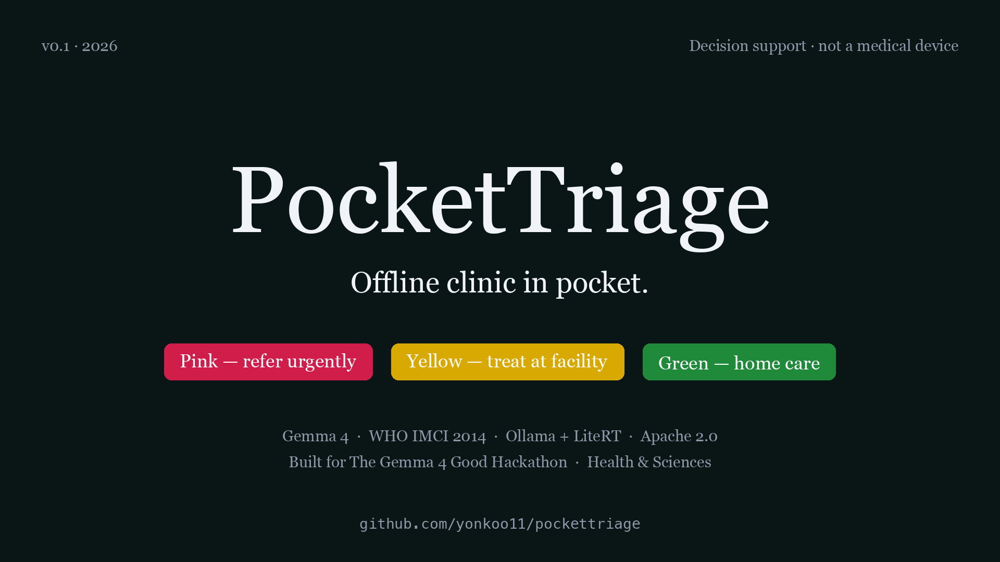

# PocketTriage



> Offline clinic in pocket. WHO IMCI triage for community health workers, running Gemma 4 fully on-device.


[](https://huggingface.co/spaces/yonko11/pockettriage)
[](https://yonkoo11.github.io/pockettriage/)

PocketTriage helps community health workers (CHWs) triage paediatric patients (2 months – 5 years) using the WHO Integrated Management of Childhood Illness (IMCI) protocol. The CHW enters symptoms and an optional photo. Gemma 4 (E2B / E4B) running on-device returns a traffic-light tier (Pink/Yellow/Green) and a structured referral pathway. Nothing leaves the device.

This is the V1 of a real product, not a demo. Apache 2.0. Distribution outreach to WHO Digital Health, India NHM ASHA, and Nigerian NPHCDA drafted under `outreach/`. Safety layer enforced (R13–R16, 17 unit tests). Phase 1 Gate PASS: 4 / 4 canonical IMCI scenarios with zero outbound packets — see [`eval/airplane-test-log.md`](eval/airplane-test-log.md).

## Why on-device?

Cloud LLMs need internet. Patchy 2G is a fact of life in the deployments where IMCI matters most: rural clinics in Anambra, ASHA workers in Maharashtra, refugee camps. Gemma 4's open-weight E4B model + Google AI Edge's LiteRT lets us put the full protocol classifier on a $80 Android phone, with no network calls, no API key, no per-query cost, no patient data leaving the device.

## What's in the box (V1)

| Component | Status | Path |
|---|---|---|
| WHO IMCI protocol encoding | ✓ | [`who-imci/protocol-summary.md`](who-imci/protocol-summary.md) |
| Inference adapter (Ollama HTTP) | ✓ | [`laptop/infer.py`](laptop/infer.py) |
| Safety layer (R13–R16) | ✓ | [`laptop/safety.py`](laptop/safety.py) (17 unit tests passing) |
| System prompt + JSON output contract | ✓ | [`laptop/system_prompt.py`](laptop/system_prompt.py), [`laptop/schema.json`](laptop/schema.json) |
| Gradio UI | ✓ | [`laptop/app.py`](laptop/app.py) |
| 4 canonical IMCI eval scenarios | ✓ | [`eval/scenarios.json`](eval/scenarios.json) |
| Phase 1 Gate eval runner | ✓ | [`laptop/eval_runner.py`](laptop/eval_runner.py) |
| Airplane-mode verification log | ✓ | [`eval/airplane-test-log.md`](eval/airplane-test-log.md) |
| Hugging Face Space (Docker + Ollama) | ✓ live | https://huggingface.co/spaces/yonko11/pockettriage |
| Distribution outreach — 3 named contacts | ✓ drafted | [`outreach/`](outreach/) |
| Kaggle writeup (1,419 words) | ✓ | [`writeup/kaggle-writeup.md`](writeup/kaggle-writeup.md) |
| Video script + record checklist | ✓ | [`writeup/video-script.md`](writeup/video-script.md) |
| Cover image (1920×1080) | ✓ | [`writeup/cover-image.png`](writeup/cover-image.png) |
| Phase 4.7 communication-pack checklist | ✓ | [`writeup/comm-pack-checklist.md`](writeup/comm-pack-checklist.md) |
| Android LiteRT V2 | V2 roadmap — NOT in V1 submission ([rationale](ai/sponsor-integration.md)) | `android/` |

## Run locally (≤ 30 minutes from clean clone)

### Prerequisites

- macOS, Linux, or Windows
- Python 3.12+
- 10 GB free disk (model weights)
- 8 GB RAM minimum (16 GB recommended for E4B; E2B fits in 8 GB)
- Ollama 0.23.1 or newer (Gemma 4 native architecture support)

### Install Ollama

```bash
# macOS
brew install ollama  # then upgrade if < 0.23.1
# Or download latest directly:
# curl -L https://ollama.com/download/Ollama-darwin.zip -o /tmp/o.zip && unzip /tmp/o.zip -d /Applications

# Linux
curl -fsSL https://ollama.com/install.sh | sh
```

### Pull the model

```bash
ollama serve &       # in a separate terminal, or run as a service
ollama pull gemma4:e4b   # or gemma4:e2b for lower-memory devices
```

The download is ~9.6 GB for E4B, ~7.2 GB for E2B. The model is the official Google Gemma 4 release; PocketTriage does NOT redistribute weights.

### Set up the Python env and run

```bash
cd laptop
python3.12 -m venv .venv
source .venv/bin/activate
pip install -r requirements.txt

# Smoke test the inference path
python infer.py "11-month-old boy, cough 3 days, breathing 58/min, chest indrawing, refuses to drink"

# Run the Phase 1 Gate eval
python eval_runner.py

# Launch the UI
python app.py
# open http://127.0.0.1:7860
```

### Verify airplane mode

The product's reason to exist is offline operation. Verify it:

1. Launch Ollama + the app
2. Turn off WiFi AND cellular (or `sudo ifconfig en0 down` on macOS)
3. Run the 4 eval scenarios via the UI
4. Open the browser DevTools Network tab — zero requests outside `127.0.0.1:11434`

The `eval/airplane-test-log.md` file records the airplane-mode verification run.

## How it works

```
CHW symptoms + optional photo
            │
            ▼
┌──────────────────────────────┐
│ infer.py                     │
│   - builds chat with WHO     │
│     IMCI system prompt       │
│   - HTTP POST → 127.0.0.1:   │
│     11434/api/chat           │
└──────────────────────────────┘
            │
            ▼
┌──────────────────────────────┐
│ Ollama runtime               │
│   gemma4:e4b (5 GB Q4_K_M)   │
│   - native function calling  │
│   - native multimodal vision │
└──────────────────────────────┘
            │
            ▼ raw model output
┌──────────────────────────────┐
│ infer._extract_first_json    │
│ infer._validate_shape        │
│   - tolerant JSON extraction │
│   - schema coercion          │
└──────────────────────────────┘
            │
            ▼ {tier, pathway, reasoning, confidence}
┌──────────────────────────────┐
│ safety.apply_safety_layer    │
│   R13 danger-sign → Pink     │
│   R14 confidence < 0.4 → esc │
│   R15 adult case → refuse    │
└──────────────────────────────┘
            │
            ▼ TriageResult
┌──────────────────────────────┐
│ Gradio UI renders            │
│   tier badge + pathway +     │
│   reasoning + flags          │
└──────────────────────────────┘
```

## Safety architecture

The model is a powerful but fallible classifier. The safety layer enforces three invariants regardless of model output:

- **R13 — danger-sign keyword force-Pink.** If the symptom description or model reasoning contains any of the WHO IMCI general danger signs (unable to drink, vomits everything, convulsions, lethargic, unconscious, stiff neck, chest indrawing, etc.), the tier is forced to Pink and "Refer urgently" is added to the pathway.
- **R14 — confidence floor.** If the model self-reports confidence below 0.4, "Escalate to medical officer" is appended to the pathway regardless of tier.
- **R15 — adult-condition refusal.** If the input describes an adult patient or condition (chest pain in adult, stroke in adult, pregnancy emergency, etc.), the system returns a Refused result with a referral to adult emergency protocol.
- **R16 — disclaimer banner.** Non-dismissable disclaimer rendered in the UI: "Decision support based on WHO IMCI 2014. Does NOT replace clinical judgment. Paediatric only (2 months – 5 years)."

See `laptop/safety.py` for implementation and `laptop/test_safety.py` for the 17 unit tests.

## Known limitations

These are documented honestly because they affect deployment decisions:

- **Photo accuracy on darker skin tones.** Image classifiers trained largely on lighter-skin datasets underperform on darker skin. PocketTriage treats photo input as a supplementary signal, not the primary classifier. The pathway must always be groundable in the text description alone.
- **No formal clinical validation.** The 4 canonical eval scenarios are derived from the WHO IMCI Chart Booklet 2014 and verify the model agrees with the standard classification. They are NOT a regulatory clinical trial. Do not deploy in clinical use without local validation.
- **Single-language V1.** English only. Hindi, Igbo, and Hausa localization are V2.
- **Runtime caveat.** Some quantized GGUF distributions of Gemma 4 trigger an iSWA-attention bug in older `llama-cpp` versions. PocketTriage uses Ollama's native gemma4 architecture support (introduced in v0.23.1), which avoids the bug.

## License

Apache 2.0 for code. The Gemma 4 model weights are subject to Google's Gemma Terms of Use (https://ai.google.dev/gemma/terms). See `LICENSE` for full text.

## Contributing

See `CONTRIBUTING.md`. We especially welcome:
- Localization (system prompt + UI strings)
- Additional eval scenarios from regional IMCI training material
- Android V2 (LiteRT runtime) contributions
- Real-world deployment feedback from CHWs

## Distribution

PocketTriage is meant to be adopted, not sold. Outreach drafted during V1 build (sent immediately after submission, when there is a live demo URL to share):

- WHO Digital Health Department — [`outreach/who-digital-health.md`](outreach/who-digital-health.md) (Dr. Alain Labrique, Geneva)
- India NHM ASHA programme — [`outreach/india-nhm-asha.md`](outreach/india-nhm-asha.md) (Add. Secretary NHM + Maharashtra state + NHSRC)
- Nigerian NPHCDA / FMoH — [`outreach/nigeria-fmoh-phc.md`](outreach/nigeria-fmoh-phc.md) (Dr. Muyi Aina + Anambra SPHCDA)
- Public Hugging Face Space — [`huggingface-space/`](huggingface-space/) (Docker + Ollama; deploys with `hf auth login` + Space push)

## Built for

The Gemma 4 Good Hackathon (Google DeepMind, May 2026). Submission under Health & Sciences Impact track + LiteRT Special Tech track.
